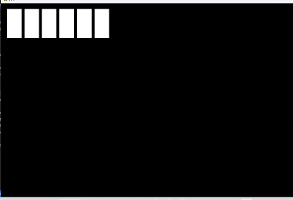
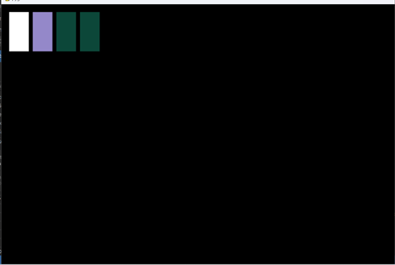
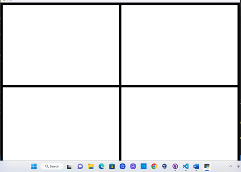
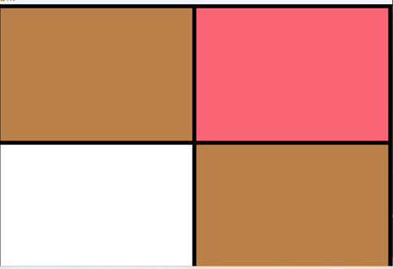
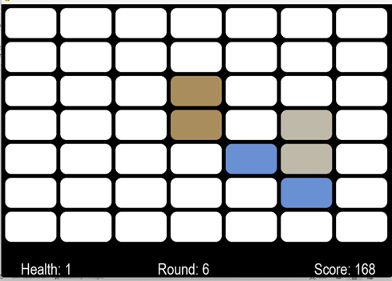
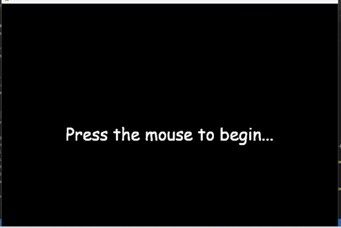
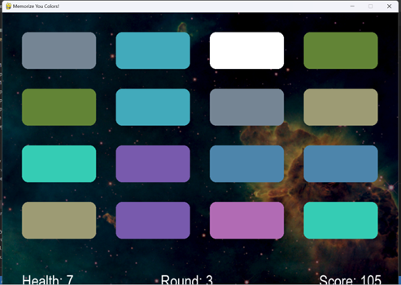

# Memorize Your Colors

## Overview

*Memorize Your Colors* was written for an educational purpose to serve pre-college students in grades k-12. It is a color matching game to stimulate the thinking and memory of the youth as well as teach colors and comparison. *Memorize Your Colors* is copy-righted and any use of the code without permission from the owners/developers is prohibitted. 

*Memorize Your Colors* is a classic style matching game but with a twist. There is a combo score for each match you get in a row. There is a wildcard on each level that has an odd amount of cards. The wildcard is a match within itself which also adds to your health. You are given health and each wrong match will subtract one from the health count. There is also a high score tracker that will allow you to see the highest local score. The colors are randomly generated through a RGB generator so some colors may be close together so pay attention. 
#

## Development Environment

This software was written in Python with the libraries of pygame, time, json, random, and math. It was written over a course of 5 two-week sprints. The version control system used was Git, Github, and Github Desktop. There are 5 developers who helped in the creation of this project: Brennon Laney, Andrew Leland, Bradley Payne, Bryan Loertscher, and Jessica Payne.
#

## Useful Websites

* [PyGame Documentation](https://www.pygame.org/docs/)
* [Free Sounds](https://freesound.org/)
* [Online Convert](https://online-convert.com/)

# Progress By Sprint 
## Sprint 1
* Project idea creation
* Role Assignments
* Project Plan
* Project Design
* Installing neccessary software environments and libraries
## Sprint 2
* User interface created
* Board class created (display of cards and interactions with user interface)
* Health Class created
* Cards Class created (generating of random cards with matches)
* Debugging created classes
* QA testing for created classes
## Sprint 3
* Improvements to classes made in Sprint 2
* Integration of Cards Class with Board Class
* Layout of cards improved
* Levels implimented
* Card sizes are dynamic
* README template made and updated.
* QA testing for all software currently created
## Sprint 4
* Sound effects added
* Improved deck generation
* Rounded Card edges
* Health implimented
* Score implimented
* QA testing for all software currently created
## Sprint 5
* Menu Screen created
* Score Combo created and implimented
* High score implimented
* README updated
* Commented Code
* Negative Score combo added
* More sounds added
* Fixed timer on board class
* Debugging
* QA testing
* Added background design behind cards
* Added more spacing between cards to see background
* Fixed crash issue
* High score display added
# Progress Pictures By Sprint

## Sprint 1
No picture available since it was mostly brainstorming and confrencing with one another.
## Sprint 2

## Sprint 3

## Sprint 4

## Sprint 5

# Roles and Assignments

Role | Team member
-------- | -------- 
Project Manager | Brennon Laney
Team Leader | Andrew Leland 
Quality Assurance | Bradley Payne
Configuration Manager | Bryan Loertscher
Documentation Manager | Jessica Payne
 |
<!--- Graphic Designer |	Gergo M  Commented out until he does something on the prodject-->

## Assignments 
To manage our assignments, progress, and To-do's, we used a website called Trello. Below is a link to our Trello Board:
 
### [Trello Board: *Memorize Your Colors*](https://trello.com/b/Lzs0ir4K/memorize-your-colors) 
#
## Planned Project Requirements
Your Project Requirements | Completed
------------------------- | ---------
Matching Colors along with a user interface | X
Random aspect to mix up the cards for each new game | X
Simple art design for cards |  Design Plan Changed
Win game condition, a way to lose (maybe a health system) | X
Goal that we need to achieve, brainstorm, very achievable | X
Sound Design, and Music | X
Level counter, add more cards | X
High score marker when it ends | X
Background behind the cards, (use Unsplash for background?) | X
|

#
 
### Disclaimer
Many of the sound effects (specifically those beginning with "hurray" or "wrong") were taken from the files of an old computer game from the 90s called *Living Letters*. We do not claim any right or ownership of these sound effects, we merely appreciate their excellence.
#
